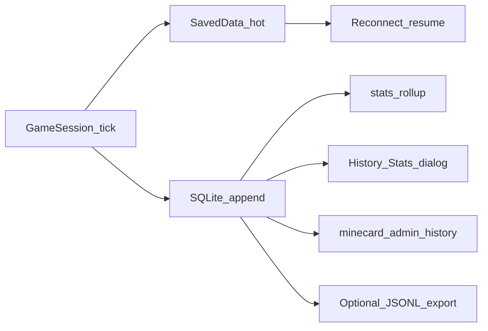

# Minecard — lưu trữ & lịch sử chơi

Thiết kế persistence và soi lịch sử / thống kê. Luật chơi nằm ở [minecard_game_rules_poker_blackjack.md](minecard_game_rules_poker_blackjack.md); thứ tự mốc ở [implement.md](implement.md); kiến trúc chung ở [ke-hoach.md](ke-hoach.md).

**Hiện tại:** `WalletSavedData` + `SessionSavedData` (solo) + `RoomSavedData` (sảnh/escrow) + SQLite history. Solo mid-round resume được; bàn phòng mid-hand hoàn escrow rồi giữ sảnh.

## 1. Hai lớp dữ liệu



| Lớp | Công nghệ | Mục đích |
|-----|-----------|----------|
| **Hot** | Minecraft `SavedData` (NBT, theo world) | Ví, escrow, session đang mở — resume sau reconnect / restart |
| **History** | SQLite `world/minecard/minecard.db` | Ledger, ván đã xong, events, rollup stats — soi và đối soát |
| **Phụ** | JSONL rotate + export JSON | Đọc tay / backup; không phải source of truth |

Không dùng JSON thuần làm sổ cái chính (khó query, race khi ghi đồng thời).

## 2. Hot state — SavedData

Path logic: world SavedData (Fabric / vanilla `SavedData` API), không nằm trong `config/`.

### 2.1. `WalletSavedData`

Thay `DemoBank` ở mốc 2.

```text
playerUUID → itemId (string) → balance (long ≥ 0)
```

- Chỉ item id + component mặc định (theo [ke-hoach.md](ke-hoach.md)).
- Ghi **trước** khi chuyển phase phụ thuộc số dư (nạp, khóa cược, payout, hoàn).

### 2.2. Active session snapshot

Serialize gần `BlackjackRoundState` (và sau này session Poker):

- `playerId`, `phase`, shoe, dealer cards / shown / hole
- player hands (cards, bet, flags, outcome, shown)
- `unitBet`, `held`, `balance` mirror, `stakeItemId`
- `turnTicksLeft`, `dialogAway`, reveal (`dealIndex`, `stepCooldown`, …)

Resume khi player vào lại hoặc server bật lại với snapshot đủ. Snapshot thiếu → hoàn escrow vào balance (room) hoặc hủy demo sạch.

### 2.3. Room escrow (mốc 3+)

- `roomId`, `stakeItemId`, host UUID
- Mỗi ghế: lock `(balancePart, inventoryPart)`, bet, ready
- Host bankroll lock cho max payout (BJ 3:2)

## 3. History — SQLite

**Path:** `world/minecard/minecard.db` (per-world).

**Driver:** JDBC SQLite `include` trong jar Minecard khi implement — client vanilla không cài gì thêm.

### 3.1. Schema

```sql
CREATE TABLE players (
  uuid TEXT PRIMARY KEY NOT NULL,
  last_name TEXT NOT NULL,
  first_seen_ms INTEGER NOT NULL,
  last_seen_ms INTEGER NOT NULL
);

CREATE TABLE sessions (
  session_id TEXT PRIMARY KEY NOT NULL,
  game TEXT NOT NULL,              -- BJ | PK | ...
  mode TEXT NOT NULL,              -- SOLO_DEMO | ROOM
  room_id TEXT,                    -- nullable
  host_uuid TEXT,                  -- nullable
  stake_item TEXT NOT NULL,
  started_at_ms INTEGER NOT NULL,
  ended_at_ms INTEGER
);

CREATE TABLE hands (
  hand_id TEXT PRIMARY KEY NOT NULL,
  session_id TEXT NOT NULL REFERENCES sessions(session_id),
  hand_index INTEGER NOT NULL,
  started_at_ms INTEGER NOT NULL,
  ended_at_ms INTEGER,
  dealer_cards_json TEXT,          -- after resolve / for audit
  result_summary TEXT
);

CREATE TABLE hand_seats (
  hand_id TEXT NOT NULL REFERENCES hands(hand_id),
  seat_index INTEGER NOT NULL,
  player_uuid TEXT NOT NULL,
  bet INTEGER NOT NULL,
  cards_json TEXT NOT NULL,
  outcome TEXT,                    -- WIN | LOSE | PUSH | PLAYER_BLACKJACK | ...
  payout INTEGER NOT NULL DEFAULT 0,
  actions_summary TEXT,            -- e.g. HIT,HIT,STAND
  PRIMARY KEY (hand_id, seat_index)
);

CREATE TABLE ledger (
  id INTEGER PRIMARY KEY AUTOINCREMENT,
  ts_ms INTEGER NOT NULL,
  player_uuid TEXT NOT NULL,
  item_id TEXT NOT NULL,
  delta INTEGER NOT NULL,
  balance_after INTEGER NOT NULL,
  source TEXT NOT NULL,            -- BALANCE | INVENTORY | ESCROW | PAYOUT | ADMIN
  reason TEXT NOT NULL,            -- BET_LOCK | PAYOUT | REFUND | DEPOSIT | WITHDRAW | ADMIN_REFUND | ...
  session_id TEXT,
  hand_id TEXT,
  idempotency_key TEXT NOT NULL UNIQUE
);

CREATE TABLE events (
  id INTEGER PRIMARY KEY AUTOINCREMENT,
  ts_ms INTEGER NOT NULL,
  session_id TEXT,
  hand_id TEXT,
  player_uuid TEXT,
  type TEXT NOT NULL,              -- DEAL | HIT | STAND | DOUBLE | SPLIT | TIMEOUT | SETTLE | ...
  payload_json TEXT
);

CREATE TABLE player_stats (
  player_uuid TEXT NOT NULL,
  game TEXT NOT NULL,              -- BJ | PK | ALL
  hands_played INTEGER NOT NULL DEFAULT 0,
  wins INTEGER NOT NULL DEFAULT 0,
  losses INTEGER NOT NULL DEFAULT 0,
  pushes INTEGER NOT NULL DEFAULT 0,
  blackjacks INTEGER NOT NULL DEFAULT 0,
  net_by_item_json TEXT NOT NULL DEFAULT '{}',
  last_hand_at_ms INTEGER,
  PRIMARY KEY (player_uuid, game)
);

CREATE INDEX idx_ledger_player_ts ON ledger(player_uuid, ts_ms);
CREATE INDEX idx_ledger_hand ON ledger(hand_id);
CREATE INDEX idx_events_session ON events(session_id);
CREATE INDEX idx_events_hand ON events(hand_id);
CREATE INDEX idx_hands_session ON hands(session_id);
CREATE INDEX idx_hand_seats_player ON hand_seats(player_uuid);
```

### 3.2. Card JSON

Mảng ngắn, ổn định để audit:

```json
[{"s":"S","r":"A"},{"s":"H","r":"K"}]
```

`s` = S/H/D/C; `r` = A,2–10,J,Q,K. Bài úp lúc chơi không ghi mặt vào event public; sau settle ghi đủ dealer trong `hands.dealer_cards_json`.

### 3.3. Idempotency

Mỗi dòng `ledger` có `idempotency_key` duy nhất, ví dụ:

```text
{handId}:bet:{seatIndex}
{handId}:payout:{seatIndex}
{uuid}:deposit:{ts}:{nonce}
admin:{ticketId}:refund
```

Click đôi / replay packet không tạo dòng tiền thứ hai.

## 4. JSONL & export (phụ)

| Artefact | Path | Ghi chú |
|----------|------|---------|
| Ledger mirror | `world/minecard/logs/ledger-YYYYMMDD.jsonl` | Một object JSON / dòng; rotate theo ngày |
| Event mirror | `world/minecard/logs/events-YYYYMMDD.jsonl` | Tuỳ chọn; có thể gộp file |
| Hand export | `world/minecard/export/<hand_id>.json` | Admin dump một ván |

Source of truth vẫn là SQLite. JSONL chỉ backup / đọc ngoài game.

## 5. Retention & quyền

- Config: `historyRetentionDays` (mặc định **90**). Prune `events` / `hands` cũ (và ledger nếu policy cho phép) lúc server start hoặc định kỳ.
- Lưu UUID + `last_name`; đủ bài để soi tranh chấp.
- Player chỉ xem data **của mình**.
- `minecard.admin` (hoặc OP khi không có LuckPerms): xem mọi người, export hand, ghi `ledger` với `reason=ADMIN_REFUND`.

## 6. Soi lịch sử & thông số (UX)

### 6.1. Player — dialog vanilla

- `/minecard profile` hoặc nút **Hồ sơ** trên menu chính.
- Tóm tắt từ `player_stats`: thắng / thua / hòa / BJ, net theo từng `item_id`, số ván.
- Danh sách 10–20 hand gần nhất (`hand_seats` ⋈ `hands`).
- Bấm một hand → chi tiết: bài mình, bài dealer (sau resolve), bet, payout, outcome, `actions_summary`.

Không cần mod client — `multi_action` + `plain_message`.

### 6.2. Admin — lệnh

```text
/minecard admin history <player> [limit]
/minecard admin hand <hand_id>
/minecard admin ledger <player> [item]
/minecard admin export hand <hand_id>
```

Mọi điều chỉnh tiền admin → một dòng `ledger` (`source=ADMIN`, `reason=ADMIN_REFUND` hoặc `ADMIN_ADJUST`) + cập nhật `WalletSavedData`.

### 6.3. Khi nào ghi (theo mốc)

| Mốc | Ghi gì |
|-----|--------|
| **Hiện tại (demo)** | Không persist; restart mất `DemoBank` / session |
| **Mốc 2 — Ví** | `WalletSavedData` + `ledger` + cập nhật `player_stats` khi settle solo BJ |
| **Mốc 3–4 — Phòng / BJ đủ** | `sessions`, `hands`, `hand_seats`, `events` đầy đủ |
| **Mốc 5 — Hồ sơ / admin** | Dialog profile + lệnh admin history (có thể ship sớm hơn nếu mốc 2 đã có bảng) |

## 7. Liên kết code hiện tại

| Hiện có | Vai trò sau này |
|---------|-----------------|
| `DemoBank` | Thay bằng `WalletSavedData` |
| `BlackjackRoundState` | Shape snapshot hot + nguồn ghi `hands` / `hand_seats` lúc settle |
| `BlackjackGames.SESSIONS` | Load/save qua Active session SavedData |
| `BlackjackOutcome` | Map sang `hand_seats.outcome` / stats |

Chi tiết luật payout và escrow: [minecard_game_rules_poker_blackjack.md](minecard_game_rules_poker_blackjack.md) §1, §8, §37–41.
