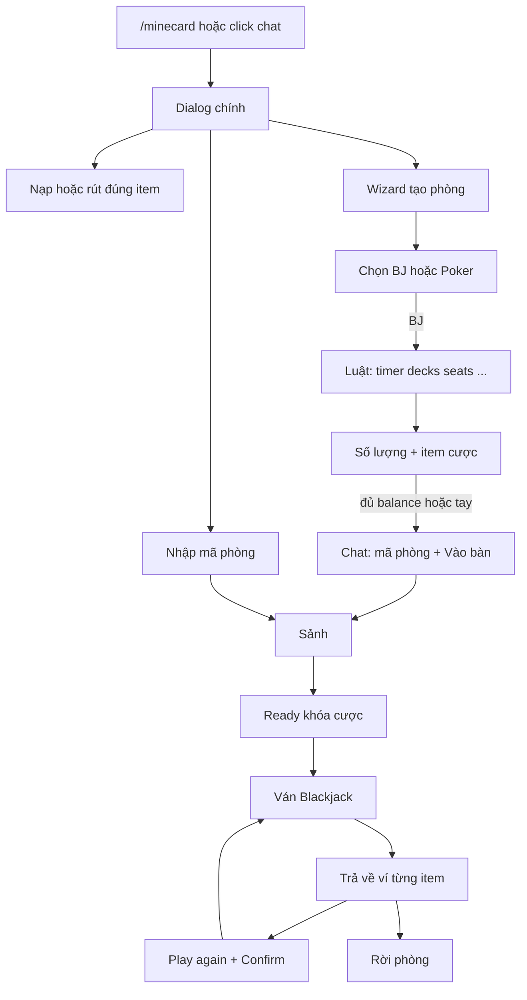

# Minecard: phòng cược server-side cho Fabric 26.3

Mod Fabric 26.3 chỉ chạy logic trên server. Client vanilla 26.3 vẫn vào được. Lá bài hiện đủ hình 52 quân qua resource pack của server. LuckPerms gán quyền; không có plugin thì người thường vẫn chơi và dùng lệnh, OP có quyền admin. Ví, phòng và Blackjack vẫn tự viết vì không có mod 26.3 nào giữ đúng vật phẩm chủ phòng chọn.

Client vanilla join bình thường vì mod không đăng ký item, block, entity, menu hay packet riêng. Mọi thứ người chơi thấy là lệnh, chat, dialog, boss bar, action bar và âm thanh vanilla.

Không quy đổi sang tiền thật, không tỉ giá giữa các vật phẩm, không Vault hay tiền tệ mod khác. Phòng táo vàng chỉ nhận táo vàng.

Thứ tự làm và ràng buộc cho Cursor nằm ở [implement.md](implement.md). Mốc đầu tiên ở đó là hiện đủ 52 quân trên GUI. Luật BJ/Poker chi tiết (kèm tag DEMO/ROOM): [minecard_game_rules_poker_blackjack.md](minecard_game_rules_poker_blackjack.md). Lưu trữ ví/session (SavedData) và lịch sử/stats (SQLite): [data-and-history.md](data-and-history.md).

## Vì sao client vanilla vẫn dùng được

Custom GUI cần mod ở client. Minecraft 26.3 đã có dialog và sự kiện click `custom` trong protocol vanilla ([Dialog](https://minecraft.wiki/w/Dialog)): server gọi `openDialog`, nút gửi `custom` / `dynamic/custom` kèm NBT, server xử lý. Người chơi không cần quyền op và không bị hộp xác nhận lệnh.

Lệnh `/minecard` (quyền 0) vẫn có, để ai không muốn bấm dialog vẫn thao tác được. Chat phòng public dùng cùng loại click `custom`, ví dụ `[Vào bàn]`.

`fabric.mod.json` để `environment: "*"` nhưng chỉ có entrypoint `main`, không có code client. Dedicated server tải mod; client Fabric vô tình bỏ jar vào cũng không vẽ gì thêm. Client vanilla không cần file này.

Công cụ: Java 25, Loom 1.17, Gradle 9.6, Loader 0.19.5, mapping Mojang (`loom.officialMojangMappings()`).

## Thư viện dùng lại, và những mod không gắn

Chỉ nhận phụ thuộc server-side. Client vanilla không cài thêm gì.

Dùng khi build:

- **Fabric API `0.160.7+26.3`**: lifecycle, lệnh Brigadier, và [Permission API](https://maven.fabricmc.net/docs/fabric-api-0.160.4+26.3/net/fabricmc/fabric/api/permission/v1/package-summary.html). Server cài jar này cùng Minecard. Dialog và click `custom` là protocol vanilla, không cần thư viện dialog riêng.
- **Server Translations API `v3.2.0+26.3`** ([Nucleoid](https://github.com/NucleoidMC/Server-Translations/releases)): nhét vào jar Minecard (`include`). File `data/minecard/lang/vi_vn.json` và `en_us.json`. Mỗi người thấy ngôn ngữ client vanilla đã chọn lúc vào server. Không tự viết bảng dịch.

Phân quyền hướng tới **LuckPerms Fabric `5.5.85`** (26.x), cài trên server, không cài ở client. Minecard chỉ gọi Fabric Permission API, không nhúng LuckPerms vào jar.

- Có LuckPerms: node trong LuckPerms quyết định. `minecard.play` cho chơi và mọi lệnh thường (`/minecard` mở menu, tạo phòng, vào phòng, nạp, rút). `minecard.admin` cho hoàn cược, đóng bàn kẹt.
- Không có LuckPerms hay plugin quyền nào khác: người chơi thường dùng được toàn bộ lệnh chơi. OP (operator của server) có thêm quyền admin. Không ai bị chặn chơi chỉ vì server chưa cài LuckPerms.

Không gắn, vì lệch yêu cầu hoặc không có bản 26.3:

- **PolyWallet**: Blackjack và poker có sẵn, client vanilla qua Polymer, nhưng chỉ **1.21.11**. Cược bằng chip, ví tiền, emerald hoặc kim cương, không phải đúng vật phẩm chủ phòng đang cầm. Không phải thư viện để gọi.
- **CasinoPlugin**: Paper/Spigot 26.1, không chạy trên Fabric.
- **Polymer `0.18.x+26.3`**: thư viện vật phẩm/block ảo cho client vanilla. Dialog 26.3 đã đủ menu nên đợt này không thêm. Để sau nếu cần bàn bài nhìn thấy trên thế giới; không dùng nó để đúc chip.
- **owo-lib**: GUI và config sync nằm ở client. Bản đang thấy là 26.1, không phải 26.3.
- Mod rig casino (client gian lận dispenser): không dùng.

Ví theo từng item, phòng, timer và luật Blackjack không có bản 26.3 tương thích để gọi lại, nên phần đó vẫn viết trong Minecard.

## Cược giữ nguyên vật phẩm

Ví lưu theo **từng item id**, số lượng là số nguyên dài, không gộp loại này sang loại khác.

- Nạp và rút vẫn có, nhưng không bắt buộc trước khi vào bàn. Nạp lấy đồ đang cầm trên tay chính. Chỉ nhận stack đúng id và component mặc định. Đồ có tên, enchant hoặc component lạ bị từ chối, không xóa.
- Số dư nằm trong `SavedData` của world. Trừ đồ trong túi trước, cộng ví sau, cùng một tick server.
- Rút: trừ ví trước, trả về túi theo max stack. Túi đầy thì phần dư nhả xuống đất tại người chơi đang online. Không xóa phần không nhét được.
- Đồ đang khóa trong ván không rút, không vứt, không dùng được.
- Creative và spectator không được nạp, cược hay vào bàn (tắt trong config nếu muốn mở).

Phòng do chủ phòng chọn vật phẩm bằng đồ đang cầm lúc tạo. Táo vàng không đổi ra kim cương.

### Lấy cược: balance trước, túi sau

Tạo phòng, vào phòng và chốt mức cược đều trừ theo thứ tự này:

1. Trừ `balance` của đúng item id.
2. Phần còn thiếu lấy trong inventory (hotbar và túi chính). Không tính ender chest, shulker, đồ dưới đất.

Chủ phòng và người vào đều phải đủ lúc chọn mức cược. Người chơi đủ cho cửa của mình. Chủ phòng đủ trả thắng tối đa của cửa đó (Blackjack 3:2). Có thể vào thẳng bằng đồ trong túi, bằng balance, hoặc cả hai. Thiếu tổng hai nguồn thì từ chối, không khóa một phần.

Mỗi khoản khóa ghi riêng số lấy từ balance và số lấy từ túi, để hoàn đúng chỗ. Trừ balance rồi lấy túi trong cùng một tick. Lấy túi thất bại thì cộng lại balance ngay.

Đồ đã chốt nằm trong escrow của bàn, không còn trong túi. Đếm lại đúng lúc khóa, vì túi có thể đổi giữa lúc mở menu và lúc bấm xác nhận.

## Phòng và luồng chơi

- Chủ phòng là **nhà cái**, không cầm bài. Người khác cược với nhà cái. Server **không** thu phí ván — chỉ khóa đúng mức cược (Ready / Play again). Hết lượt người chơi: lỗ cái vẫn úp đến khi nhà cái bấm Hit/Stand. Nhà cái có thể rút ở 17 (soft-17 mặc định bật; nút Hit khi &lt; 21). Không countdown lượt (timer 0) — tránh reset dialog khiến không scroll được. Nhà cái có nút Hit/Stand (lượt cái) và Kick từng ghế (sảnh + bàn). Kick giữa ván = stand-out như disconnect, không hoàn cược; sảnh/sau resolve thì hoàn escrow. Rời bàn rồi bấm lại link chat vẫn vào lại được nếu phòng còn (sảnh hoặc giữa hai ván). Play again → Confirm → host Deal.
- Trước khi chia, nhà cái phải đủ trả thắng tối đa của các cửa đang cược (Blackjack 3:2), lấy balance trước rồi tới túi. Thiếu thì cửa đó không được nâng cược.
- Một người chỉ ở một phòng. Mỗi người tối đa một phòng làm chủ.
- Công khai: broadcast một dòng chat, hover hiện luật và vật phẩm, click vào ghế trống.
- Riêng tư: `/minecard invite <tên>` chỉ gửi cho người đó.
- Sảnh: danh sách ghế, sẵn sàng, chủ bấm bắt đầu, ai cũng rời được khi chưa khóa cược.
- Hết ván thì ở lại để cược ván sau hoặc rời. Tiền thắng và hoàn cược ghi vào balance, không nhét thẳng vào túi.

## Khi ván bị cắt

Đồ khóa không bị xóa. Hoàn cược ưu tiên đúng nguồn: phần từ balance về balance; phần từ túi về túi nếu người đó đang online và còn chỗ. Túi đầy hoặc người offline thì phần đó vào balance. Không nhả đồ xuống đất lúc server tắt hoặc lúc người chơi đã thoát.

- **Ngắt kết nối giữa ván.** Giữ ghế và escrow. Trong ân hạn, vào lại thì mở dialog và chơi tiếp. Hết ân hạn thì stand, ván chơi nốt, kết quả vào balance của người đó. Kick xử lý như mất kết nối. Chết hoặc đổi dimension không hủy ghế; `/minecard` mở lại dialog.
- **Hết vật phẩm.** Tạo phòng, vào phòng hoặc nâng cược bị từ chối nếu balance cộng túi không đủ. Double, split và bảo hiểm cần thêm đồ thì nút không chạy, cửa cũ giữ nguyên. Ván sau không đủ mức tối thiểu thì ngồi ngoài ván đó, ghế vẫn còn.
- **Túi đầy.** Trả thưởng và hoàn cược không phụ thuộc ô trống. Rút chủ động mới cố nhét túi; phần dư rơi tại chân nếu đang online. Hoàn phần đã lấy từ túi mà không còn chỗ thì chuyển sang balance và báo cho người chơi.
- **Cả bàn offline.** Mọi ghế đang ngồi, kể cả chủ phòng, cùng mất kết nối (bàn đủ người, ví dụ 4, hoặc ít hơn): hủy ván, hoàn toàn bộ escrow và quỹ nhà cái vào balance từng người, rồi đóng phòng. Không có người online để nhận thắng. Chỉ người chơi thoát còn nhà cái online thì những ghế đó hết ân hạn sẽ stand, ván tiếp tục.
- **Server dừng giữa chừng.** Mỗi lần đổi escrow ghi `SavedData` trước hành động kế. Tắt sạch thì lưu pha ván, bài, lượt, giờ và escrow. Bật lại: snapshot đủ thì chơi tiếp và báo khi người chơi vào; snapshot thiếu hoặc cả bàn vẫn offline thì hoàn escrow vào balance và hủy ván. Crash dùng bản ghi cuối. Không hoàn bằng cách vứt đồ lúc shutdown.
- **Trừ dở.** Click vào phòng hai lần không trừ hai lần. Mod khác lấy mất đồ giữa lúc kiểm tra và lúc khóa thì hủy thao tác và hoàn phần đã trừ. Chủ phòng hết quỹ giữa lúc người khác chốt cược thì không chia bài, nhả mọi khóa tạm.

## Blackjack (ván chơi được ngay)

Luật mặc định, chủ phòng chỉnh lúc tạo:

- 6 bộ bài (1–8), xào lại khi còn ít bài.
- Nhà cái đứng mọi 17. Tùy chọn rút soft 17.
- Blackjack tự nhiên trả 3:2, làm tròn xuống. Hòa trả cửa. Nhà cái có blackjack thì người chơi thua trừ khi cũng blackjack.
- Nhà cái lật lỗ sau khi mọi người ra quyết định, có nhìn lỗ nếu lá ngửa là Át hoặc 10.
- Hit, stand. Double ở hai lá đầu nếu ví đủ. Split một lần khi đôi; Át tách chỉ được thêm một lá. Không tách lại.
- Bảo hiểm khi nhà cái ngửa Át, nửa cửa, ăn 2:1. Bật mặc định.
- Đầu hàng muộn trả nửa cửa. Tắt mặc định.
- Hết giờ lượt (mặc định 25 giây) thì stand. Boss bar đếm ngược, action bar hiện điểm và bài của mình, title ngắn lúc thắng/thua/hòa. Âm thanh vanilla (`UI_BUTTON_CLICK`, `NOTE_BLOCK`).
- Mỗi người chỉ thấy bài của mình và lá ngửa của nhà cái trong dialog của họ. Mỗi lá hiện đúng hình trong bộ 52 quân.

## Giao diện lá bài

Bộ bài trên GUI là bài Tây đủ hình, không thay bằng tên vật phẩm hay ô màu.

- 52 quân: 4 chất bích, cơ, rô, chuồn; mỗi chất A, 2–10, J, Q, K. Hình đúng chất và đúng rank.
- Thêm 2 joker trong bộ asset. Blackjack mặc định không chia joker. Joker chỉ vào bộ bài khi phòng bật, hoặc khi game sau (Liar’s Bar) cần.
- Client vanilla không cài mod. Hình lá nằm trong resource pack của server: mỗi quân là một glyph font, vẽ trong dialog với `height` GUI ≈36 để vừa một hàng mà vẫn đọc được. Server **mời** pack lúc join, không bắt buộc (từ chối không bị kick). Layout bàn dùng **hàng ngang** (`CardGrid` / `CardLayer`): Poker và Blackjack đều 5 hàng (1 cái/bài chung + 4 người). `/minecard cards [poker|blackjack]` là showcase.
- **Chọn lá (vanilla):** không click trực tiếp glyph trong `PlainMessage`. Cách làm: `multi_action` — mỗi lá một `ActionButton` (label = glyph), `action` kiểu `custom` + NBT id lá; server nhận `custom_click`. Hoặc `single_option` input (radio/dropdown) rồi nút xác nhận. Cả hai đều protocol vanilla, không cần mod client.
- **Hiệu ứng lật/phát:** dialog vanilla không có animation 3D. Cách làm: đổi glyph mặt ↔ mặt sau rồi `openDialog` lại theo tick. `/minecard cards loop` demo vòng 5s phát (từng lá úp) → 5s lật ngửa → 5s lật úp → 5s thu bài; `/minecard cards stop` dừng.
- **Menu:** `/minecard` / `/bj` mở dialog chính (Bank sgui, tạo phòng wizard, ô nhập mã phòng, tải pack, hồ sơ). Không còn solo BJ trên menu. `/minecard join <id>`; `/minecard pack` / `download`; `/pk` showcase poker.
- **Tạo phòng:** chọn game → (BJ) chỉnh luật mặc định → chọn số lượng + item cược → kiểm balance rồi tay chính/phụ → broadcast chat mã phòng + link join.
- **Bank:** GUI chest server-side qua **sgui** (vanilla client). Hai chế độ — **Nạp** (ô trống để staging, bỏ đồ vào rồi bấm Confirm mới cộng ví; đóng/không Confirm thì trả đồ về túi) và **Rút** (hiện đúng stack ví, lấy ra là trừ ví). Menu có 2 nút; trong chest có Compass để chuyển chế độ. Hàng dưới: ◀ / Switch / Confirm / Close / ▶.
- **Ví:** `WalletSavedData` (world, nhiều item id); escrow balance→túi. SQLite history — [data-and-history.md](data-and-history.md).
- **Blackjack phòng (MVP):** chủ = nhà cái (không cầm bài); ghế Ready khóa cược; Start khi host đủ quỹ max 3:2; `TableBlackjack` lượt từng người; bài người khác ẩn đến resolve.
- **Config:** `config/minecard.json` (tạo mặc định lúc load) — decks phòng, insurance (mặc định bật), surrender (mặc định tắt), soft-17, timer, `packHost` / `packPort`.
- **Insurance / surrender:** solo + bàn phòng có phase `INSURANCE` khi cái ngửa Át (`insuranceEnabled`); late surrender solo nếu `surrenderEnabled`. Soft-17 / shoe theo config.
- **Disconnect phòng:** host thoát → đóng phòng hoàn cược; player lobby → refund; đang chơi → auto-stand.
- **Persist phòng:** `RoomSavedData` giữ sảnh + escrow qua restart; ván giữa chừng → hoàn cược về ví, phòng về LOBBY (không resume mid-hand).
- **Hồ sơ:** dialog stats W/L/P/BJ, net theo item, hand gần đây + chi tiết; admin `stats`/`ledger`.
- Pack lá bài: texture trong jar, **không** copy tay. Ưu tiên GitHub Release HTTPS `minecard-cards.zip` đúng version mod **nếu asset tồn tại** (probe lúc start); thiếu/404 → HTTP local (`packHost`/`packPort`, mặc định 8765). Client localhost vẫn Accept qua `http://127.0.0.1:port`. UUID pack cố định + SHA zip ổn định (timestamp entry = 0); `/minecard pack` cooldown 10s cùng fingerprint — không nhân bản pack trên client. Vanilla **không** Accept HTTP remote — join/`/minecard pack` gửi link chat + hướng dẫn bật Resource Packs. Override: `packUrl` HTTPS công khai. Mở firewall TCP `packPort`.
- Bài úp dùng một mặt sau chung. Người chơi không thấy mặt bài của người khác.

## Menu, thông tin, ràng buộc

Dialog (không cần mod client):

- Chính: hint/stats → ô mã phòng → Số dư / Vào / Tạo phòng / Tải pack (1 cột); tạm ẩn hồ sơ. Nạp/Rút/Xem số dư trong menu Số dư; xem chỉ đọc + phân trang. Dialog `pause=false` + `after_action=none`.
- Tạo phòng (wizard): chọn Blackjack/Poker (Poker báo chưa mở); trang luật BJ (timer, decks, seats, insurance, soft-17, surrender — default từ config); trang cược (số lượng + chọn item từ balance/tay); đủ đồ thì tạo và chat mã + join.
- Trong ván: từng lá hiện hình đúng quân, điểm, nút Hit / Stand / Double / Split / Insurance / Surrender đúng lúc luật cho phép, thời gian còn lại.
- Hồ sơ: thắng, thua, hòa, lãi ròng **từng loại vật phẩm** (chỉ thống kê, không đổi vật phẩm).

Ràng buộc thêm: chống spam phòng, hết hạn sảnh nếu không bắt đầu, hoàn cả bàn nếu chủ phòng mất kết nối quá ân hạn giữa ván, `/minecard admin end|refund` cho quyền admin. Nhật ký giao dịch ngắn để đối soát, gồm nguồn trừ (balance hay túi) và lý do hoàn.

`config/minecard.json`: thời gian lượt, ân hạn mất kết nối, thời gian sảnh, số phòng tối đa, chặn creative. Ngôn ngữ đi theo client qua Server Translations API (`vi_vn`, `en_us`), không có nút đổi ngôn ngữ riêng trong hồ sơ.

## Khung cho Poker và Liar’s Bar

`GameSession` nhận action dạng id + NBT và tick của server. Blackjack là ván đầu tiên, sau khi mốc 52 quân đã hiện trên GUI. Wizard tạo phòng hiện Blackjack và Poker (Poker báo chưa mở). Chưa code ván Poker hay Liar’s Bar trong đợt này. Hai game sau cắm vào cùng ví, phòng, timer và dialog:

- Poker: Texas Hold’em, blind bằng đúng vật phẩm phòng, fold/check/call/raise, side pot.
- Liar’s Bar: bluff, mỗi người chỉ thấy bài/xúc xắc của mình trong dialog riêng, người thua trả đúng vật phẩm phòng.

Cách kiểm tra từng mốc nằm ở [implement.md](implement.md).
